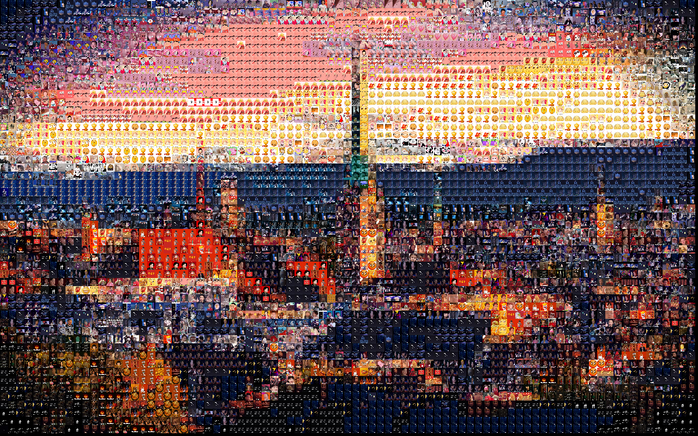

<div align="center">
  
</div>
<br />

[](https://pydrawing.readthedocs.io/)
[](https://pypi.org/project/pydrawing/)
[](https://pypi.org/project/pydrawing)
[](https://github.com/CharlesPikachu/pydrawing/blob/master/LICENSE)
[](https://pypi.org/project/pydrawing/)
[](https://github.com/CharlesPikachu/pydrawing/issues)
[](https://github.com/CharlesPikachu/pydrawing/issues)

Documents: https://pydrawing.readthedocs.io/


# Pydrawing
```
Beautify your image or video.
You can star this repository to keep track of the project if it's helpful for you, thank you for your support.
```


# Support List
| Beautifier                 | Introduction                                               | Related Paper                                                                    | Code                                                              |  in Chinese              |
| :----:                     | :----:                                                     | :----:                                                                           | :----:                                                            |  :----:                  |
| glitch                     | [click](https://mp.weixin.qq.com/s/Yv0uPLsTGwVnj_PKqYCmAw) | N/A                                                                              | [click](./pydrawing/modules/beautifiers/glitch)                   |  信号故障特效            |
| douyineffect               | [click](https://mp.weixin.qq.com/s/RRnrO2H84pvtUdDsAYD9Qg) | N/A                                                                              | [click](./pydrawing/modules/beautifiers/douyineffect)             |  抖音特效                |
| characterize               | [click](https://mp.weixin.qq.com/s/yaNQJyeUeisOenEeoVsgDg) | N/A                                                                              | [click](./pydrawing/modules/beautifiers/characterize)             |  视频转字符画            |
| cartoonise                 | [click](https://mp.weixin.qq.com/s/efwNQl0JVJt6_x_evdL41A) | N/A                                                                              | [click](./pydrawing/modules/beautifiers/cartoonise)               |  图像卡通化              |
| photomosaic                | [click](https://mp.weixin.qq.com/s/BG1VW3jx0LUazhhifBapVw) | N/A                                                                              | [click](./pydrawing/modules/beautifiers/photomosaic)              |  拼马赛克图片            |
| beziercurve                | [click](https://mp.weixin.qq.com/s/SWpaTPw9tOLs5h1EgP30Vw) | N/A                                                                              | [click](./pydrawing/modules/beautifiers/beziercurve)              |  贝塞尔曲线画画          |
| geneticfittingcircle       | [click](https://mp.weixin.qq.com/s/L0z1ZO1Qztk0EF1KAMfmbA) | N/A                                                                              | [click](./pydrawing/modules/beautifiers/geneticfitting)           |  遗传算法拟合图像-圆形   |
| geneticfittingpolygon      | [click](https://mp.weixin.qq.com/s/L0z1ZO1Qztk0EF1KAMfmbA) | N/A                                                                              | [click](./pydrawing/modules/beautifiers/geneticfitting)           |  遗传算法拟合图像-多边形 |
| pencildrawing              | [click](https://mp.weixin.qq.com/s/K_2lGGlLKHIIm4iSg0xCUw) | [click](https://jiaya.me/archive/projects/pencilsketch/npar12_pencil.pdf)        | [click](./pydrawing/modules/beautifiers/pencildrawing)            |  铅笔素描画              |
| cartoongan                 | [click](https://mp.weixin.qq.com/s/18fUOO5fH1PVUzTMNNCWwQ) | [click](https://openaccess.thecvf.com/content_cvpr_2018/CameraReady/2205.pdf)    | [click](./pydrawing/modules/beautifiers/cartoongan)               |  卡通GAN                 |
| fastneuralstyletransfer    | [click](https://mp.weixin.qq.com/s/Ed-1fWOIhI52G-Ugrv7n9Q) | [click](https://cs.stanford.edu/people/jcjohns/papers/eccv16/JohnsonECCV16.pdf)  | [click](./pydrawing/modules/beautifiers/fastneuralstyletransfer)  |  快速风格迁移            |
| cartoonizeface             | [click](https://mp.weixin.qq.com/s/L0z1ZO1Qztk0EF1KAMfmbA) | [click](https://arxiv.org/pdf/1907.10830.pdf)                                    | [click](./pydrawing/modules/beautifiers/cartoonizeface)           |  人脸卡通化              |


# Install

#### Preparation
- [ffmpeg](https://ffmpeg.org/): You should set ffmpeg in environment variable.
- [Pytorch](https://pytorch.org/get-started/previous-versions/): To apply some of the supported beautifiers (e.g., cartoongan), you need to install pytorch and corresponding dependencies following [tutorial](https://pytorch.org/get-started/previous-versions/).

#### Pip install
```sh
run "pip install pydrawing"
```

#### Source code install
```sh
(1) Offline
Step1: git clone https://github.com/CharlesPikachu/pydrawing.git
Step2: cd pydrawing -> run "python setup.py install"
(2) Online
run "pip install git+https://github.com/CharlesPikachu/pydrawing.git@master"
```


# Quick Start
```python
import random
from pydrawing import pydrawing

filepath = 'asserts/dog.jpg'
config = {
    "savedir": "outputs",
    "savename": "output"
}
drawing_client = pydrawing.pydrawing()
drawing_client.execute(filepath, random.choice(drawing_client.getallsupports()), config=config)
```


# Screenshot
<div align="center">
  
</div>
<br />
<div align="center">
  
</div>
<br />
<div align="center">
  
</div>
<br />


# Projects in Charles_pikachu
- [Games](https://github.com/CharlesPikachu/Games): Create interesting games by pure python.
- [DecryptLogin](https://github.com/CharlesPikachu/DecryptLogin): APIs for loginning some websites by using requests.
- [Musicdl](https://github.com/CharlesPikachu/musicdl): A lightweight music downloader written by pure python.
- [Videodl](https://github.com/CharlesPikachu/videodl): A lightweight video downloader written by pure python.
- [Pytools](https://github.com/CharlesPikachu/pytools): Some useful tools written by pure python.
- [PikachuWeChat](https://github.com/CharlesPikachu/pikachuwechat): Play WeChat with itchat-uos.
- [Pydrawing](https://github.com/CharlesPikachu/pydrawing): Beautify your image or video.
- [ImageCompressor](https://github.com/CharlesPikachu/imagecompressor): Image compressors written by pure python.
- [FreeProxy](https://github.com/CharlesPikachu/freeproxy): Collecting free proxies from internet.
- [Paperdl](https://github.com/CharlesPikachu/paperdl): Search and download paper from specific websites.


# More
#### WeChat Official Accounts
*Charles_pikachu*  
