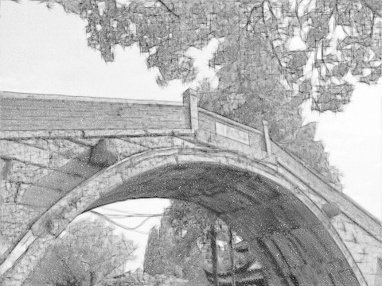

# PencilDrawing
```sh
Implementation of "Combining Sketch and Tone for Pencil Drawing Production-Cewu Lu, Li Xu, Jiaya Jia".
You can star this repository to keep track of the project if it's helpful for you, thank you for your support.
```

# Introduction in Chinese
https://mp.weixin.qq.com/s/K_2lGGlLKHIIm4iSg0xCUw

# Environment
- windows 10
- python3.5+(have installed the neccessary dependencies)
	- opencv-python
	- numpy
	- argparse
	- pillow
	- scipy

# Usage
#### Step1
```sh
Install the neccessary dependencies:
run "pip install -r requirements.txt"
```
#### Step2
```sh
run as "python main.py -i <image_path> -m <mode> -s <savename>", for example:
python main.py -i testPic/1.jpg -m color -s output.jpg
```

# Effect
  
  
  

# References
```sh
[1] https://zh.wikipedia.org/wiki/%E5%8F%8D%E9%8B%B8%E9%BD%92
[2] http://www.cse.cuhk.edu.hk/~leojia/projects/pencilsketch/pencil_drawing.htm
[3] Lu C, Xu L, Jia J. Combining sketch and tone for pencil drawing production[C]//Proceedings of the Symposium on Non-Photorealistic Animation and Rendering. Eurographics Association, 2012: 65-73.
[4] https://github.com/duduainankai/pencil-python
[5] https://github.com/taldatech/image2pencil-drawing
[6] https://github.com/candycat1992/PencilDrawing
```

# More
#### WeChat Official Accounts
*Charles_pikachu*  
