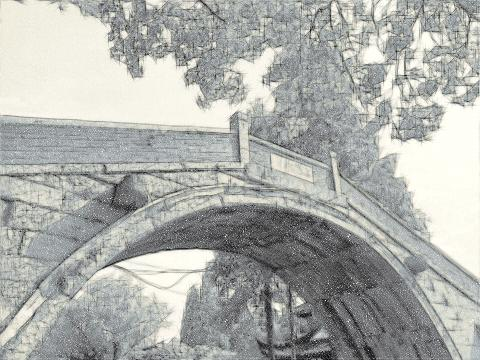
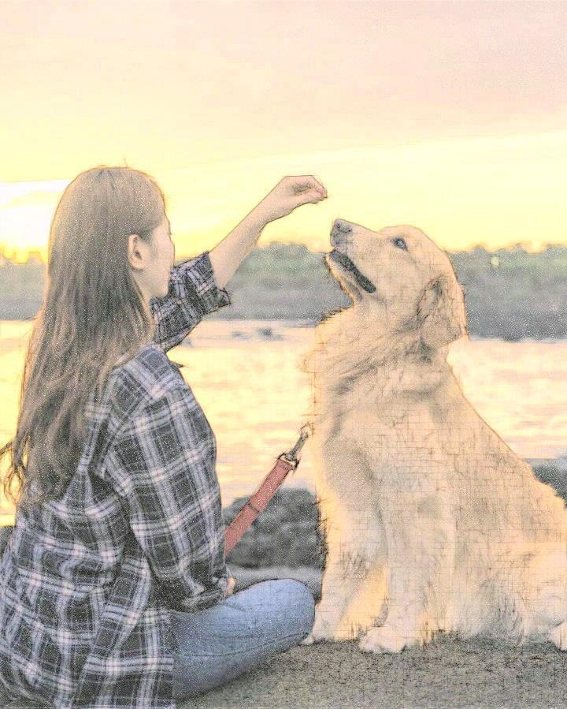
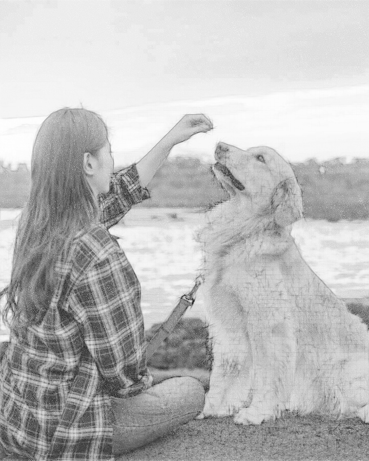
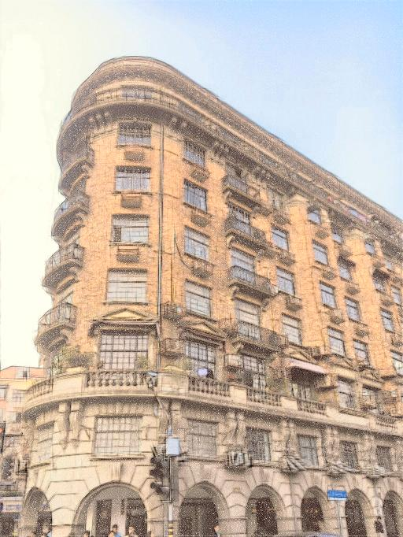
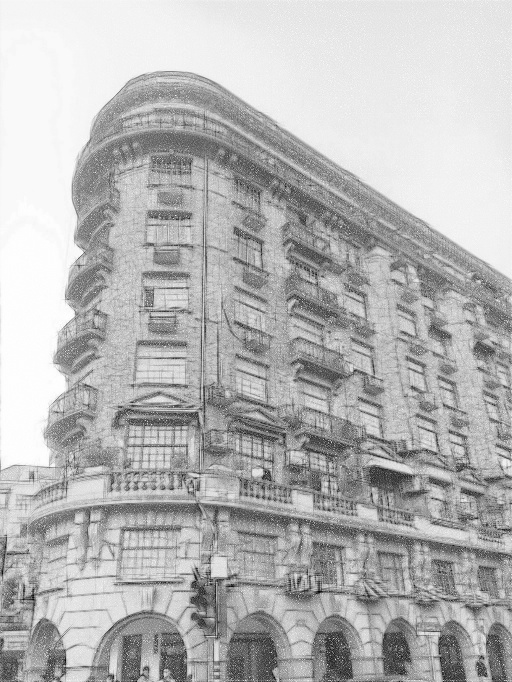

# PencilDrawing
```
Implementation of "Combining Sketch and Tone for Pencil Drawing Production-Cewu Lu, Li Xu, Jiaya Jia".
You can star this repository to keep track of the project if it's helpful for you, thank you for your support.
```

# Introduction
#### in Chinese
https://mp.weixin.qq.com/s/K_2lGGlLKHIIm4iSg0xCUw

# Environment
```
OS: Windows 10
Python: python3.x with the packages in requirements.txt
```

# Usage
```
usage: main.py [-h] [-i IMAGE_PATH] [-m MODE] [-s SAVENAME]

PencilDrawing

optional arguments:
  -h, --help     show this help message and exit
  -i IMAGE_PATH  the path of image need to be processed
  -m MODE        color or gray
  -s SAVENAME    filename of output

cmd example:
python main.py -i testPic/1.jpg -m color -s output.jpg
```

# Results
  
  
  

# References
```
[1] https://zh.wikipedia.org/wiki/%E5%8F%8D%E9%8B%B8%E9%BD%92
[2] http://www.cse.cuhk.edu.hk/~leojia/projects/pencilsketch/pencil_drawing.htm
[3] Lu C, Xu L, Jia J. Combining sketch and tone for pencil drawing production[C]//Proceedings of the Symposium on Non-Photorealistic Animation and Rendering. Eurographics Association, 2012: 65-73.
[4] https://github.com/duduainankai/pencil-python
[5] https://github.com/taldatech/image2pencil-drawing
[6] https://github.com/candycat1992/PencilDrawing
```

# More
#### WeChat Official Accounts
*Charles_pikachu*  
